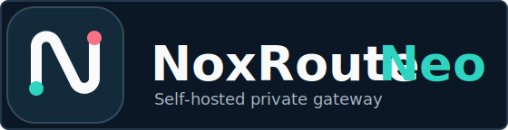
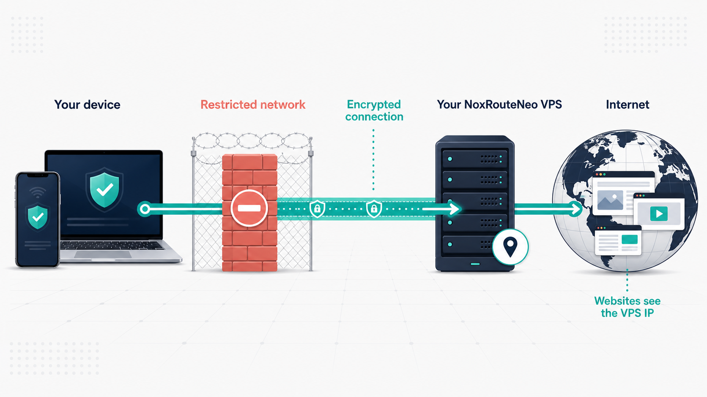
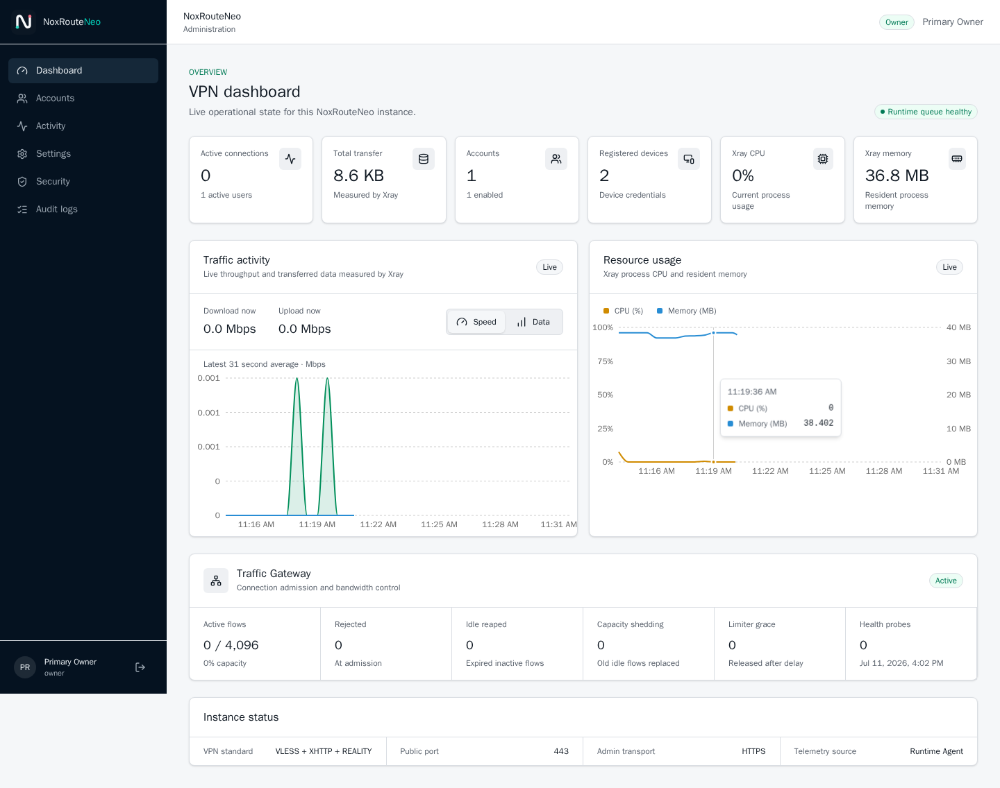
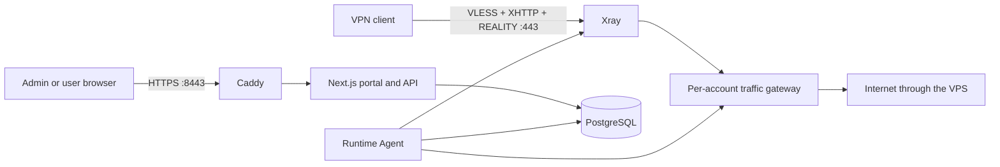

<p align="center">
  
</p>

<p align="center">
  <strong>Deploy your own VLESS + XHTTP + REALITY gateway on one VPS.</strong>
  <br>
  Free, open source and self-hosted, with guided installation and separate admin and user portals.
</p>

<p align="center">
  <a href="https://github.com/drslid/NoxRouteNeo/actions/workflows/ci.yml"></a>
  
  
  
  
  <a href="LICENSE"></a>
</p>

> [!IMPORTANT]
> NoxRouteNeo is alpha software. Test it on a non-critical VPS before relying on it. It improves connection privacy but does not guarantee anonymity or access through every restricted network.

## Quick install

You need:

- a fresh Ubuntu LTS or Debian VPS with a public IPv4 address;
- `root` access or a user with `sudo`;
- at least 1 GB RAM and 8 GB disk;
- TCP ports `80`, `443` and `8443` allowed by the VPS provider firewall;
- one [DuckDNS](https://www.duckdns.org/) subdomain and its account token.

Run this single command on the VPS. It installs the pinned `v1.0.0-alpha.2` release:

```bash
sudo apt-get update && sudo apt-get install -y curl ca-certificates git && sudo curl -fsSL https://raw.githubusercontent.com/drslid/NoxRouteNeo/v1.0.0-alpha.2/install.sh -o /tmp/noxrouteneo-install.sh && sudo env NOXROUTE_REF=v1.0.0-alpha.2 bash /tmp/noxrouteneo-install.sh
```

The installer asks for the interface language, DuckDNS subdomain and DuckDNS token. It then:

1. verifies the operating system, architecture, disk, memory and public ports;
2. installs Docker Engine and Docker Compose when required;
3. updates DuckDNS and obtains the HTTPS certificate;
4. generates local secrets and the initial owner account;
5. pulls the versioned multi-architecture images from GHCR;
6. starts the complete stack and runs health checks.

At completion, the terminal prints the generated credentials once:

```text
Admin URL: https://YOUR_DOMAIN.duckdns.org:8443
VPN endpoint: YOUR_DOMAIN.duckdns.org:443
Owner username: owner
Temporary owner password: generated-once
```

Sign in, change the temporary password, enable TOTP and create the first VPN user.

**Detailed procedure:** [Installation guide](https://neo.noxroute.com/getting-started/install/) · [First sign-in](https://neo.noxroute.com/getting-started/first-sign-in/)

## What NoxRouteNeo is

NoxRouteNeo is a Docker-based, self-hosted VPN management platform for one Ubuntu or Debian VPS. It combines an Xray `VLESS + XHTTP + REALITY` endpoint with a Next.js portal, PostgreSQL, DuckDNS automation, device credentials and local usage policies.

<p align="center">
  
</p>

The VPS hosts the portal, API, database, certificates, traffic gateway and VPN runtime. Browsing destinations and URL history are not recorded.

### Included

- Owner and administrator roles for VPN users, limits and instance settings.
- A separate user portal for consumption, devices, QR codes and subscriptions.
- One revocable credential per phone, tablet or desktop.
- Fast, Balanced and Stealth XHTTP connection profiles.
- Data quota, expiry, device count and per-account TCP speed policies.
- Live traffic, CPU, memory, gateway capacity, audit and security views.
- Automatic six-hour bans for repeated login or subscription abuse.
- English, Spanish, French, German, Simplified Chinese, Arabic, Russian, Portuguese, Hindi and Urdu.

<p align="center">
  
</p>

## Connect a device

1. The administrator creates a VPN user and defines its limits.
2. The user signs in at the same web URL and opens **Devices**.
3. The user registers one device and selects a connection profile.
4. The user imports the subscription in INCY using the direct action, QR code or URL.
5. The credential binds to the first compatible INCY HWID that refreshes it.

| Client       | Platforms             | Link                                                                         |
| ------------ | --------------------- | ---------------------------------------------------------------------------- |
| INCY         | iPhone, iPad, Android | [Official downloads](https://incy.cc/)                                       |
| INCY Desktop | Windows, Linux, macOS | [Latest release](https://github.com/INCY-DEV/incy-platforms/releases/latest) |

NoxRouteNeo is not affiliated with INCY. Generic Xray clients may import the generated connection, but device HWID binding is an INCY-specific workflow.

**Detailed procedure:** [Connect a device](https://neo.noxroute.com/guides/connect-device/) · [User portal](https://neo.noxroute.com/guides/user-portal/) · [Connection profiles](https://neo.noxroute.com/reference/connection-profiles/)

## Architecture



PostgreSQL, Xray's API and internal control APIs are private. The public web interface uses `8443` because Xray with REALITY owns public TCP `443`; port `80` is used for certificate issuance and HTTP handling.

Read the [complete architecture and trust boundaries](https://neo.noxroute.com/reference/architecture/).

## Documentation

The complete documentation and application walkthroughs live at **[neo.noxroute.com](https://neo.noxroute.com)**:

- [Install NoxRouteNeo](https://neo.noxroute.com/getting-started/install/)
- [Admin portal](https://neo.noxroute.com/guides/admin-portal/)
- [Connect a device](https://neo.noxroute.com/guides/connect-device/)
- [VPS sizing](https://neo.noxroute.com/reference/vps-sizing/)
- [Security model](https://neo.noxroute.com/reference/security/)
- [Project comparison](https://neo.noxroute.com/project/comparison/)

Repository documentation remains available for [local development](docs/DEVELOPMENT.md), [security reports](SECURITY.md) and [contributions](CONTRIBUTING.md).

## Development

```bash
corepack enable
pnpm install --frozen-lockfile
pnpm check
```

Run the product and documentation sites locally:

```bash
pnpm dev
pnpm website dev
```

The pnpm/Turborepo workspace contains:

```text
apps/web                 Next.js admin and user application
apps/website             Astro/Starlight public documentation
packages/auth            Better Auth configuration and permissions
packages/contracts       Shared Zod contracts
packages/db              Drizzle schema and migrations
packages/ui              Shared UI components
services/runtime         Xray Runtime Agent
services/security-agent  Dedicated nftables IP-ban agent
services/traffic-gateway Per-account traffic gateway
infra                    Caddy and local infrastructure
```

## Security and scope

- Passwords are managed by Better Auth; subscription tokens are hashed.
- Production cookies are secure and HTTP-only.
- State-changing APIs enforce origin and role checks.
- Containers use reduced capabilities and read-only filesystems where possible.
- Search indexing is disabled for private admin and user portals.
- Secrets, DuckDNS tokens, REALITY private keys and application data must never be committed.

NoxRouteNeo does not include Tor, payments, multi-node orchestration, exit-country selection or domain rotation. NoxRoute is a separate future managed product presented at [noxroute.com](https://noxroute.com).

Use NoxRouteNeo only on infrastructure and networks you are authorized to operate. The operator is responsible for provider terms, local law, abuse handling and server security.

## License

NoxRouteNeo is available under the [MIT License](LICENSE).
