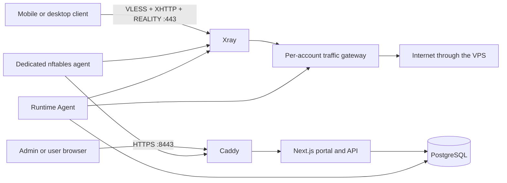
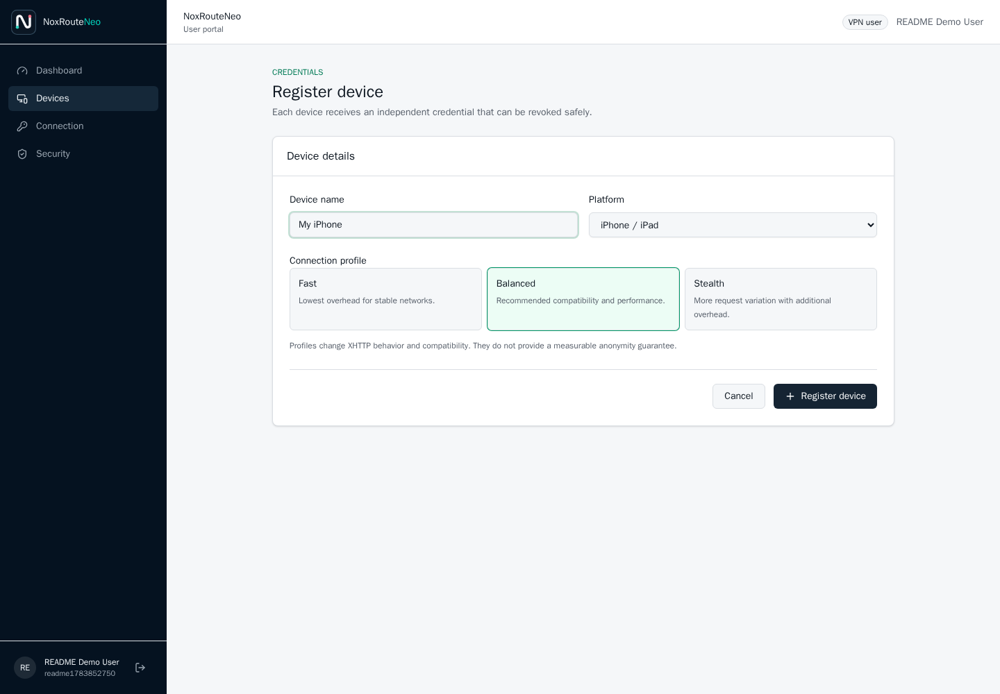
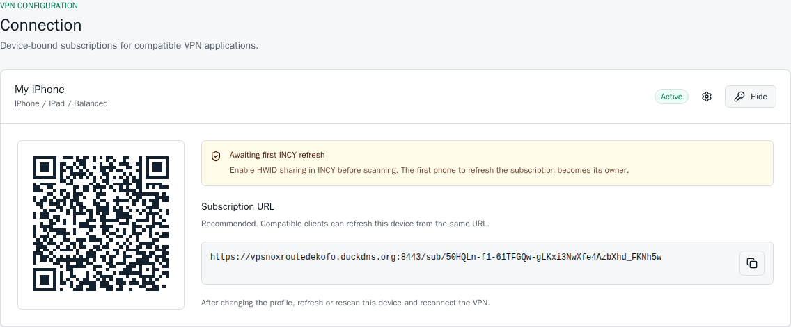

<p align="center">
  
</p>

<p align="center">
  <strong>A self-hosted VLESS + XHTTP + REALITY gateway with a modern admin and user portal.</strong>
  <br>
  Deploy a private VPN server on one VPS with Docker, DuckDNS, usage controls, device QR codes and live telemetry.
</p>

<p align="center">
  <a href="https://github.com/drslid/NoxRouteNeo/actions/workflows/ci.yml"></a>
  
  
  
  
  <a href="LICENSE"></a>
</p>

> [!IMPORTANT]
> NoxRouteNeo is an alpha proof of concept. It is not an anonymity guarantee, a commercial VPN service, or a substitute for a reviewed security architecture. Validate it on a test VPS before relying on it.

<p align="center">
  
</p>

## Table of contents

- [What NoxRouteNeo is](#what-noxrouteneo-is)
- [Features](#features)
- [Architecture](#architecture)
- [Requirements](#requirements)
- [One-command installation](#one-command-installation)
- [Roles and portals](#roles-and-portals)
- [Connect a device with INCY](#connect-a-device-with-incy)
- [Connection profiles](#connection-profiles)
- [XHTTP and REALITY](#xhttp-and-reality)
- [VPS capacity planning](#vps-capacity-planning)
- [Languages](#languages)
- [Security model](#security-model)
- [Known limitations](#known-limitations)
- [Documentation](#documentation)
- [Development](#development)
- [Project status](#project-status)
- [License](#license)

## What NoxRouteNeo is

NoxRouteNeo is a Docker-based, self-hosted VPN management platform for a single Ubuntu or Debian VPS. It combines an Xray `VLESS + XHTTP + REALITY` endpoint with a Next.js dashboard, PostgreSQL, DuckDNS automation and per-user access policies.

It is designed for people who want a small personal VPN server without operating a multi-node control plane. The VPS hosts the web portal, API, database, certificates, traffic gateway and VPN runtime.

## Features

### Administration

- Create owner-managed administrator accounts and VPN user accounts.
- Set account expiry, data quota, TCP speed limit and maximum registered devices.
- Configure DuckDNS domains, XHTTP, REALITY and instance defaults.
- Monitor Xray CPU, memory, throughput, transfer volume and active connections.
- Adapt gateway capacity, idle policy and speed presets to detected CPU and RAM.
- Inspect per-user and per-device usage without recording browsing destinations.
- Review security audit events and revoke account sessions.
- Search and paginate 30 days of audit history.
- Detect repeated login or subscription abuse, automatically block its IP for six hours and manage permanent bans.
- Enable TOTP two-factor authentication.

### User portal

- View data usage, quota, connection time, expiry and active connections.
- Register a separate credential for each phone, tablet or desktop.
- Import a stable, device-bound subscription URL by QR code or copy/paste.
- Bind an INCY subscription to the first phone HWID that refreshes it.
- Select `Fast`, `Balanced` or `Stealth` for each registered device.
- Revoke devices and manage password, sessions and TOTP.

### Deployment

- One Docker Compose stack for PostgreSQL, Next.js, Caddy, Xray and the traffic gateway.
- Interactive installer for Ubuntu and Debian on `amd64` and `arm64`.
- DuckDNS updates and Let's Encrypt certificate issuance during installation.
- English, Spanish, French, German, Simplified Chinese, Arabic, Russian, Portuguese, Hindi and Urdu.
- Right-to-left layout support for Arabic and Urdu.

## Architecture



| Service           | Responsibility                                     | Public exposure               |
| ----------------- | -------------------------------------------------- | ----------------------------- |
| `caddy`           | HTTPS and certificate management                   | TCP `80` and `8443`           |
| `web`             | Next.js portals, Better Auth and API               | Loopback only                 |
| `db`              | PostgreSQL application data                        | Private Docker network        |
| `runtime`         | Xray lifecycle, policy sync and telemetry          | TCP `443`; health on loopback |
| `traffic-gateway` | Per-account TCP rate limiting and capacity control | Private Docker network        |
| `security-agent`  | Dedicated IP ban set for public NoxRouteNeo ports  | No network API                |

The Docker socket, PostgreSQL port, Xray API and internal control APIs are not exposed publicly. Only the small `security-agent` receives host `NET_ADMIN`; it has no HTTP listener, database credentials or Docker socket and manages one dedicated nftables table.

## Requirements

| Requirement      | Minimum                                         |
| ---------------- | ----------------------------------------------- |
| Operating system | Ubuntu LTS or Debian                            |
| Architecture     | `amd64` or `arm64`                              |
| Access           | `root` or a user with `sudo`                    |
| Network          | Public IPv4 address                             |
| Memory           | 2 GiB RAM for the current source build          |
| Disk             | 12 GiB total and 6 GiB free; 20 GiB recommended |
| Public TCP ports | `80`, `443`, `8443`                             |
| DNS              | One DuckDNS subdomain and its account token     |

Port `443` is reserved for Xray. The web interface uses `8443` so REALITY does not compete with the HTTPS reverse proxy.

The running stack can support a small test workload on 1 GiB, but compiling the Next.js image from source on that amount of memory is slow and unreliable. Prebuilt GHCR images will remove this build-time requirement in a later release.

## One-command installation

Before running the command, create one DuckDNS subdomain, copy its token, and open TCP ports `80`, `443` and `8443` in the VPS provider firewall. Provider firewalls cannot be changed safely by a provider-independent installer.

On a fresh Ubuntu or Debian VPS, copy and paste this single command:

```bash
sudo apt-get update && sudo apt-get install -y curl ca-certificates git && sudo curl -fsSL https://raw.githubusercontent.com/drslid/NoxRouteNeo/main/install.sh -o /tmp/noxrouteneo-install.sh && sudo bash /tmp/noxrouteneo-install.sh
```

The installer asks only for:

- interface language, with English selected by pressing Enter;
- the existing DuckDNS subdomain name or full hostname;
- the DuckDNS token, entered without terminal echo.

The same domain serves the VPN on `443` and the web portal on `8443`. An optional Let's Encrypt contact email and separate admin/VPN domains remain available through unattended advanced variables, but are not needed for the normal installation.

The command installs Git, Docker Engine and Docker Compose, validates the OS, architecture, memory, disk and ports, updates DuckDNS, generates every application secret, configures HTTPS and Xray, creates the initial owner, starts the stack and runs a strict local health report. It also adds the required UFW rules when UFW is already active.

The command is safe to run again. A completed installation is only verified. An interrupted first build is resumed automatically when no project container or initialized PostgreSQL database exists; detected data is never deleted automatically.

### First sign-in

The final output contains:

```text
Admin URL: https://YOUR_DOMAIN.duckdns.org:8443
VPN endpoint: YOUR_DOMAIN.duckdns.org:443
Owner username: owner
Temporary owner password: generated-once
```

Sign in, change the temporary password immediately, enable TOTP, review the default account limits, then create the first VPN user.

For unattended provisioning, see [the installation guide](docs/INSTALLATION.md).

## Roles and portals

All accounts use the same sign-in URL. Better Auth redirects each role to the correct portal.

| Role    | Capabilities                                                                   |
| ------- | ------------------------------------------------------------------------------ |
| `owner` | Full instance control, administrator creation and sensitive account operations |
| `admin` | VPN user management, VPN settings, activity and operational monitoring         |
| `user`  | Own usage, devices, QR codes, connection profiles and account security         |

Web sessions expire after one hour. Administrators cannot promote other administrators, and only the owner can reset an administrator password.

`Active sessions` in the Security page means active web sign-ins, not VPN tunnels. Their public source IP addresses link to a KeyCDN geolocation lookup. Per-device VPN transfer, connection time and sampled active connections are shown in `Activity`; NoxRouteNeo does not enable destination-level Xray access logging just to recover VPN source IPs.

## Connect a device with INCY

Each phone receives a separate subscription credential. The subscription URL is the connection string; NoxRouteNeo does not expose the raw VLESS credential in the user portal because a raw VLESS string cannot be tied to physical hardware.

Install INCY from an official source:

| Platform                                | Link                                                                               |
| --------------------------------------- | ---------------------------------------------------------------------------------- |
| iPhone, iPad and Apple Silicon Mac      | [App Store](https://apps.apple.com/us/app/incy/id6756943388)                       |
| Android                                 | [Google Play](https://play.google.com/store/apps/details?id=llc.itdev.incy)        |
| Windows, Linux and other desktop builds | [INCY downloads](https://github.com/INCY-DEV/incy-platforms)                       |
| Help                                    | [Official website](https://incy.cc/) · [HWID guide](https://docs.incy.cc/en/hwid/) |

NoxRouteNeo is not affiliated with INCY. A complete walkthrough is available in the [INCY connection guide](docs/INCY.md).

1. The administrator creates a VPN user and sets its quota, expiry, speed and maximum number of devices.
2. The user signs in through the same web URL and opens `Devices`.
3. The user creates a device, names it and selects `iPhone / iPad`, `Android` or `Desktop` plus a connection profile.

<p align="center">
  
</p>

4. In INCY, the user enables HWID sharing for subscription requests.
5. The user opens `Connection`, scans the QR code with INCY or copies the subscription URL into INCY.
6. INCY refreshes the subscription, binds that credential to the phone HWID and can measure the endpoint latency.
7. The user starts the VPN. To move the credential to another phone, the old device must be revoked and recreated in NoxRouteNeo.

<p align="center">
  
</p>

The first valid INCY refresh owns the credential. A later refresh with another HWID receives `403`. NoxRouteNeo stores only an HMAC digest of the HWID, plus the reported platform/model and last subscription IP. This prevents reuse of the same subscription QR in the normal INCY flow; it cannot stop a compromised client from extracting and copying the underlying VLESS credential.

The subscription response sends INCY `sort-order: ping`, which asks the application to test and order endpoints by latency. Latency is measured by INCY from the phone's current network; the server cannot inject a truthful mobile latency value. Because NoxRouteNeo currently publishes one endpoint, some INCY views show a single ping only after a refresh or connection test.

## Connection profiles

Every profile keeps the same VPN standard: `VLESS + XHTTP + REALITY`.

| Profile    | XHTTP behavior                                      | Intended use                                    |
| ---------- | --------------------------------------------------- | ----------------------------------------------- |
| `Fast`     | `stream-one`, lowest overhead                       | Stable networks and lower latency               |
| `Balanced` | Default XHTTP behavior, device-specific short ID    | Recommended default                             |
| `Stealth`  | `packet-up`, device-specific short ID and `spiderX` | More request variation with additional overhead |

These profiles adjust transport behavior and compatibility. They do not provide a measurable anonymity or non-detection guarantee.

## XHTTP and REALITY

NoxRouteNeo always generates `VLESS + XHTTP + REALITY` credentials:

- **XHTTP path** is the HTTP-like route shared by the client and Xray, such as `/noxroute`. It is not a public web page. Changing it requires users to refresh their subscriptions.
- **REALITY target** is a stable public TLS endpoint, including port `443`, whose handshake REALITY imitates for unauthenticated traffic. It must be reachable from the VPS.
- **REALITY server name** is the hostname sent as TLS SNI. It must be accepted by the configured target and is normally the target hostname without `https://` or a port.

The defaults use `www.speedtest.net:443` and `www.speedtest.net`. These values do not route VPN traffic through Speedtest; normal authenticated traffic exits directly through the VPS.

## VPS capacity planning

The table below is a conservative planning estimate for ordinary mobile browsing at roughly 5-10 Mbps average per active device. It is not a provider guarantee and does not model simultaneous speed tests, large downloads or streaming on every device.

| VPS size       | Adaptive gateway profile | TCP flow ceiling | Fast active devices | Balanced active devices | Stealth active devices |
| -------------- | ------------------------ | ---------------: | ------------------: | ----------------------: | ---------------------: |
| 1 vCPU / 1 GB  | Small                    |            2,048 |                 1-3 |                     1-2 |                    1-2 |
| 2 vCPU / 1 GB  | Small                    |            2,048 |                 2-5 |                     2-4 |                    1-3 |
| 2 vCPU / 2 GB  | Standard                 |            4,096 |                 3-8 |                     2-6 |                    2-5 |
| 4 vCPU / 4 GB  | Performance              |            8,192 |                8-18 |                    5-15 |                   4-12 |
| 4 vCPU / 8 GB  | Performance              |            8,192 |               18-45 |                   15-40 |                  12-30 |
| 8 vCPU / 16 GB | High capacity            |           16,384 |              50-110 |                  40-100 |                  30-80 |

The flow ceiling is an admission safety limit, not a device count. A single phone may open tens or hundreds of TCP flows. Network throughput and Xray CPU normally become limiting before the flow ceiling. Benchmark the intended provider and workload before selling or promising capacity; see [the sizing methodology](docs/SIZING.md).

## Languages

The instance language is selected during installation and can later be changed in `Settings`. The selected language applies to every administrator and user on that VPS.

| Language           | Locale  | Direction |
| ------------------ | ------- | --------- |
| English            | `en`    | LTR       |
| Spanish            | `es`    | LTR       |
| French             | `fr`    | LTR       |
| German             | `de`    | LTR       |
| Simplified Chinese | `zh-CN` | LTR       |
| Arabic             | `ar`    | RTL       |
| Russian            | `ru`    | LTR       |
| Portuguese         | `pt`    | LTR       |
| Hindi              | `hi`    | LTR       |
| Urdu               | `ur`    | RTL       |

## Security model

- Passwords are managed by Better Auth and never stored in plaintext.
- Subscription tokens are hashed; recoverable application secrets use AES-256-GCM encryption.
- Production cookies are `Secure` and `HttpOnly`.
- Login and subscription endpoints are rate limited; state-changing API calls enforce same-origin and role checks.
- Ten rejected authentication/subscription requests from one public IP within five minutes trigger a six-hour ban.
- Active bans are enforced before Docker port forwarding by a dedicated nftables agent, without restarting Xray.
- Security events are retained for seven days; administrative audit logs are retained for 30 days.
- Database and internal control APIs stay on private networks or loopback.
- Containers run with dropped capabilities, read-only filesystems where possible and `no-new-privileges`.
- The application does not store browsing history, requested domains or destination URLs.

The traffic gateway uses a fail-open path when it becomes unavailable so that browsing is not interrupted. During a bypass, per-account TCP speed limits are not enforced; the admin dashboard reports this state explicitly.

Never commit `.env`, DuckDNS tokens, REALITY private keys, passwords, AWS credentials, SSH keys or application data.

Security reports should follow [SECURITY.md](SECURITY.md).

## Known limitations

- The project is still an alpha POC and has not received an independent security audit.
- Compatible clients must support recent Xray `XHTTP + REALITY` settings.
- INCY HWID binding requires HWID sharing to be enabled before the first subscription refresh. Raw Xray credentials cannot provide hardware attestation.
- TCP rate limiting is per account, while UDP remains direct for mobile compatibility.
- Connection duration and active-session metrics are sampled rather than measured continuously.
- The exit country is the VPS country; there is no multi-country exit pool.
- NoxRouteNeo does not include Tor, payments, multi-node orchestration or domain rotation.

## Documentation

- [Installation on Ubuntu and Debian](docs/INSTALLATION.md)
- [Connect a device with INCY](docs/INCY.md)
- [Local development](docs/DEVELOPMENT.md)
- [VPS sizing and benchmarks](docs/SIZING.md)
- [Security policy](SECURITY.md)
- [Contributing](CONTRIBUTING.md)

The public documentation and future GitHub Pages site are intentionally separated from the private admin and user portals hosted on the VPS.

## Development

```bash
corepack enable
pnpm install --frozen-lockfile
pnpm check
```

`pnpm check` runs ESLint, TypeScript, unit tests, ShellCheck, installer tests, Go traffic-gateway tests, Python Runtime Agent and security-agent tests, and the production Next.js build.

The monorepo uses pnpm workspaces and Turborepo:

```text
apps/web                 Next.js application and API
packages/auth            Better Auth configuration and permissions
packages/contracts       Shared Zod contracts
packages/db              Drizzle schema and migrations
packages/ui              Shared UI components
services/runtime         Xray Runtime Agent
services/security-agent  Dedicated nftables IP-ban agent
services/traffic-gateway Per-account traffic gateway
infra                    Caddy and local development infrastructure
```

## Project status

The current target is a reproducible single-VPS release with a simple installation path, documented sizing benchmarks and a GitHub Pages documentation site. No repository content is pushed automatically by the installer.

NoxRouteNeo must only be used on infrastructure and networks you are authorized to operate. The operator remains responsible for provider terms, local law, abuse handling and server security.

## License

NoxRouteNeo is available under the [MIT License](LICENSE).
